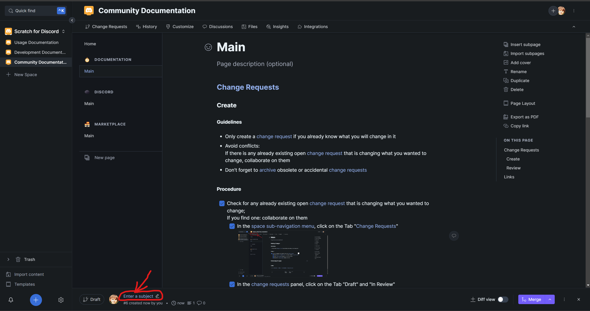

# Main

## [Change Requests](https://docs.gitbook.com/getting-started/collaboration/change-requests)__ 

_Also known as "_[_CR_](https://docs.gitbook.com/getting-started/collaboration/change-requests)_"_\
_Not to be mistaken with "_[_Pull Requests_](https://docs.github.com/en/pull-requests/collaborating-with-pull-requests/proposing-changes-to-your-work-with-pull-requests/about-pull-requests)_", "_[_PR_](https://docs.github.com/en/pull-requests/collaborating-with-pull-requests/proposing-changes-to-your-work-with-pull-requests/about-pull-requests)_"_

### Guidelines

* Only create a [change request](https://docs.gitbook.com/getting-started/collaboration/change-requests) if you already know what you will change in it
* Avoid conflicts:\
  If there is any already existing open [change request](https://docs.gitbook.com/getting-started/collaboration/change-requests) that is changing what you wanted to change, collaborate on them
* Don't forget to [archive](https://docs.gitbook.com/getting-started/collaboration/change-requests#archiving-a-change-request) obsolete or accidental [change requests](https://docs.gitbook.com/getting-started/collaboration/change-requests)
* #### [Change request](https://docs.gitbook.com/getting-started/collaboration/change-requests) subject
  * Write it before making any changes
  * #### Naming
    * Start it with its [label](https://github.com/scratch-for-discord/Documentation\_Usage/labels) ([<mark style="background-color:green;">`Feature`</mark>](https://github.com/scratch-for-discord/Documentation\_Usage/labels/Feature)/[<mark style="background-color:blue;">`Enhance`</mark>](https://github.com/scratch-for-discord/Documentation\_Usage/labels/Enhance)/[<mark style="background-color:orange;">`Fix`</mark>](https://github.com/scratch-for-discord/Documentation\_Usage/labels/Fix)/[<mark style="background-color:yellow;">`Update`</mark>](https://github.com/scratch-for-discord/Documentation\_Usage/labels/Update)/[<mark style="background-color:red;">`Deprecate`</mark>](https://github.com/scratch-for-discord/Documentation\_Usage/labels/Deprecate))
    * Following by "`:` "
    * Following by the page path of the [change request](https://docs.gitbook.com/getting-started/collaboration/change-requests), separating sub-pages with "`﹣`"
    * Following by "`︱`"
    * Following by the section path of the page of the [change request](https://docs.gitbook.com/getting-started/collaboration/change-requests), separating sub-sections with "`﹣`"
    * **Example**: the [change request](https://docs.gitbook.com/getting-started/collaboration/change-requests) subject for this change is named\
      "`Feature: Documentation﹣Main︱Change Requests﹣Guidelines`"

### Create

#### Procedure

_Must be done while following_ [#guidelines](main.md#guidelines "mention")__

* [x] Check for any already existing open [change request](https://docs.gitbook.com/getting-started/collaboration/change-requests) that is changing what you wanted to change;\
  If you find one: collaborate on them
  * [x] In the [space sub-navigation menu](https://docs.gitbook.com/getting-started/overview#space-sub-navigation), click on the Tab "[Change Requests](https://docs.gitbook.com/getting-started/collaboration/change-requests)" (1).png>)
  * [x] In the [change requests](https://docs.gitbook.com/getting-started/collaboration/change-requests) panel, click on the Tab "Draft" and "In Review".png>)
  * [x] Read all the [change requests](https://docs.gitbook.com/getting-started/collaboration/change-requests) subjects to check for any already existing open [change request](https://docs.gitbook.com/getting-started/collaboration/change-requests) are already changing what you wanted to change;\
    If you find one: collaborate on them
* [x] If every already existing open [change request](https://docs.gitbook.com/getting-started/collaboration/change-requests) are not changing what you wanted to change: \
  [create a change request](https://docs.gitbook.com/getting-started/collaboration/change-requests#creating-a-change-request)
* [x] Write the subject of the [change request](https://docs.gitbook.com/getting-started/collaboration/change-requests) 
* [x] Develop the changes on the [change request](https://docs.gitbook.com/getting-started/collaboration/change-requests)
* [x] When your [change request](https://docs.gitbook.com/getting-started/collaboration/change-requests) is production-ready, \
  [submit it](https://docs.gitbook.com/getting-started/collaboration/change-requests#submitting-a-change-request)
  * [x] If you are not sure that your [change request](https://docs.gitbook.com/getting-started/collaboration/change-requests) can be published right away: \
    you can [submit it for review](https://docs.gitbook.com/getting-started/collaboration/change-requests#reviewing-a-change-request) (recommended)
  * [x] If you are sure that your [change request](https://docs.gitbook.com/getting-started/collaboration/change-requests) can be published right away: \
    you can [submit and merge it](https://docs.gitbook.com/getting-started/collaboration/change-requests#merging-a-change-request) (not recommended)

### Review

#### Procedure

_Must be done while following_ [#guidelines](main.md#guidelines "mention")__

* [x] In the [space sub-navigation menu](https://docs.gitbook.com/getting-started/overview#space-sub-navigation), click on the Tab "[Change Requests](https://docs.gitbook.com/getting-started/collaboration/change-requests)" (1).png>)
* [x] In the [change requests](https://docs.gitbook.com/getting-started/collaboration/change-requests) panel, click on the Tab "In Review".png>)
* [x] Select the [change request](https://docs.gitbook.com/getting-started/collaboration/change-requests) you want to review
* [x] Check for any other already existing open [change requests](https://docs.gitbook.com/getting-started/collaboration/change-requests) that could conflicting with your currently in-review [change request](https://docs.gitbook.com/getting-started/collaboration/change-requests);\
  If you find some: [resolve the conflicts](https://docs.gitbook.com/getting-started/collaboration/change-requests#resolving-merge-conflicts)
* [x] Check if your currently in-review [change request](https://docs.gitbook.com/getting-started/collaboration/change-requests) content is qualitative enough and is following [#guidelines](main.md#guidelines "mention"):
  * [x] If it is not the case: turn the [change request](https://docs.gitbook.com/getting-started/collaboration/change-requests) back to a draft [change request](https://docs.gitbook.com/getting-started/collaboration/change-requests).png>) (1).png>)
  * [x] If it is the case: [merge the change request](https://docs.gitbook.com/getting-started/collaboration/change-requests#merging-a-change-request)

## Links

* [Documentation︱GitBook︱Collaboration](https://docs.gitbook.com/getting-started/collaboration)
