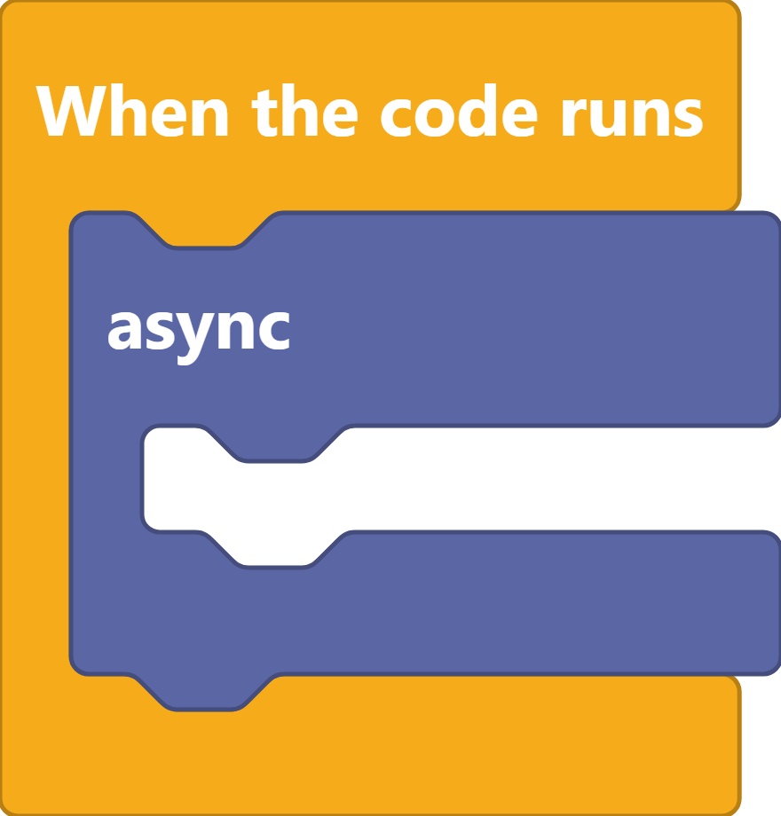

# 💼 Base

## Token

Using this block, you can connect your script to Discord, this block is required

 (2).png>)


To know how to [get a token](../tutorial/bot.md#get-the-token), check [#get-the-token](../tutorial/bot.md#get-the-token "mention")


## Webserver

Using this block, you can setup a basic HTML site for uptime apps to keep your replit 24/7.


## Process.env

For more information read [#process.env](../tutorial/hosting.md#process.env "mention")


## When bot is connected

When the bot turns on, the code will be ran. Perfect for looping or setting a database.

<figure><figcaption><p>Example of using this event</p></figcaption></figure>

<figure><figcaption></figcaption></figure>

## Bot information

To get information about a bot as a user, use this block!

<figure><figcaption></figcaption></figure>


```javascript
S4D // username of bot
1 //server count
6Mon Oct 17 2022 20:13:09 GMT+0000 (Coordinated Universal Time) // boot time
2 //in seconds, time from start
```


## Advanced



When the code runs, simply you add script without any event.

Async, will make your part of code asynchromous, you can use it for example with [functions.md](functions/functions.md "mention")

to add delay.

Shutdown the bot - the name tell it all&#x20;

Some operating system information, tells you about specs of server the bot is running on..png>)


```javascript
73.62482369534555
```

